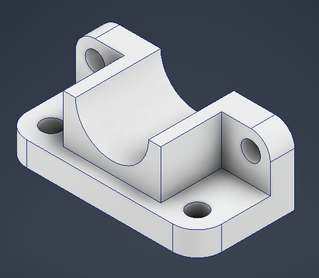
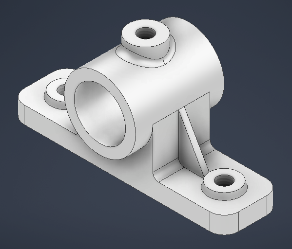
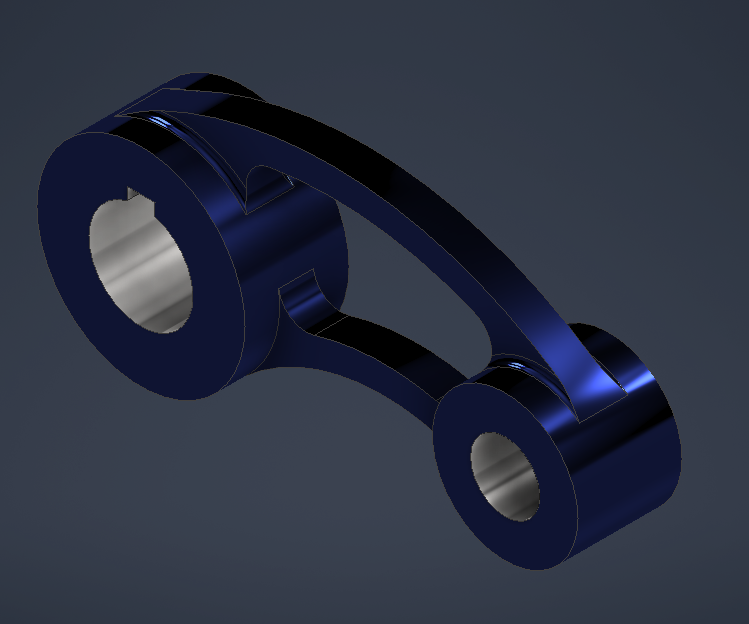
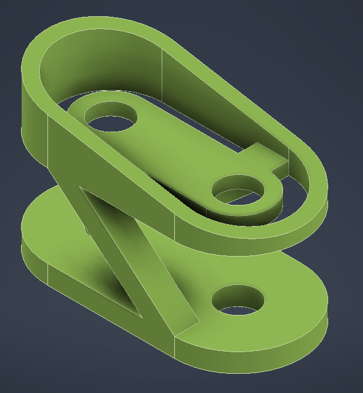

# Portfolio Disegni Meccanici

Portfolio personale di disegni tecnici meccanici realizzati con *Autodesk Inventor**.
---

## 📋 Contenuto

### Progetto 1: Staffa supporto per albero
- **File:** [Disegno_Numero_3.pdf](./Disegno_Numero_3.pdf)
- **Viste:** 

---

### Progetto 2: Supporto con cuscinetto
- **File:** [Disegno_Numero_5.pdf](./Disegno_Numero_5.pdf)
- **Viste:** 

---

### Progetto 3: Bilanciere
- **File:** [Disegno_Numero_7.pdf](./Disegno_Numero_7.pdf)
- **Viste:** 

---

### Progetto 4: Componente di supporto
- **File:** [Disegno_Numero_8.pdf](./Disegno_Numero_8.pdf)
- **Viste:** 

---

## 🛠️ Software Utilizzati
- Autodesk Inventor (modellazione 3D e tavole tecniche)

---

## 📧 Contatti
Per informazioni: [tommaso.caravaggi@gmail.com]

---

_Tutti i disegni sono stati realizzati come parte della mia formazione personale in progettazione meccanica._
